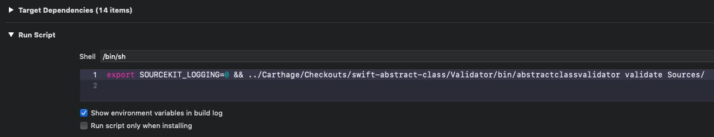

# Swift Abstract Class

[](https://travis-ci.com/uber/swift-abstract-class?branch=master)
[](https://github.com/Carthage/Carthage)
[](https://opensource.org/licenses/Apache-2.0)

Swift Abstract Class is a light-weight library along with an executable that enables compile-time safe [abstract class](https://docs.oracle.com/javase/tutorial/java/IandI/abstract.html) development for Swift projects.

## The gist

This project contains two separate parts that work together to perform abstract class validation. The `AbstractClassFoundation` module contains a `protocol` that abstract classes should conform to.

```swift
import AbstractClassFoundation

class MyAbstractClass: AbstractClass {
    var anAbstractProperty: PropertyType {
        abstractMethod()
    }
    
    func anAbstractMethod(_ arg1: Arg, arg2: Arg) -> MyReturnType {
        abstractMethod()
    }
    
    func aConcreteMethod() {
        // Method implementation omitted.
    }
}
```

Subclasses of an abstract class can also be abstract.

```swift
class AnotherAbstractClass: MyAbstractClass {
    func anotherAbstractMethod() {
        abstractMethod()
    }
}
```

The second part of this project is the `abstractclassvalidator` executable. The validator parses a specified set of Swift source files to generate an in-memory graph of class hierarchies. Based on the classes data models, it then validates the implementations against the abstract class rules. Rules include abstract classes cannot be directly instantaited; concrete subclasses of abstract classes must provide implementations of all abstract properties and methods in their class hierarchy.

In order to enable this validation to be performed at compile-time, a Xcode pre-build run-script phase is added for the project. Please refer to [Validator Integration section](#Integrate-validator-with-Xcode) below for details.

## Installation

### Install `AbstractClassFoundation` framework

#### Using [Carthage](https://github.com/Carthage/Carthage)

Please follow the standard [Carthage installation process](https://github.com/Carthage/Carthage#quick-start) to integrate the `AbstractClassFoundation` framework with your Swift project.
```
github "https://github.com/uber/swift-abstract-class.git" ~> VERSION
```

#### Using [Swift Package Manager](https://github.com/apple/swift-package-manager)

Please specify `AbstractClassFoundation` as a dependency via the standard [Swift Package Manager package definition process](https://github.com/apple/swift-package-manager/blob/master/Documentation/Usage.md) to integrate the `AbstractClassFoundation` framework with your Swift project.
```
dependencies: [
    .package(url: "https://github.com/uber/swift-abstract-class.git", .upToNextMajor(from: "VERSION_NUMBER")),
],
targets: [
    .target(
    name: "YOUR_MODULE",
    dependencies: [
        "AbstractClassFoundation",
    ]),
],
```

#### Using [CocoaPods](https://github.com/CocoaPods/CocoaPods)

Please follow the standard pod integration process and use `AbstractClassFoundation` pod.

### Install validator

#### Using [Carthage](https://github.com/Carthage/Carthage)

If Carthage is used to integrate  the `AbstractClassFoundation` framework, then a copy of the validator executable of the corresponding version is already downloaded in the Carthage folder. It can be found at `Carthage/Checkouts/swift-abstract-class/Validator/bin/abstractclassvalidator`.

#### Using [Homebrew](https://github.com/Homebrew/brew)

Regardless of how `AbstractClassFoundation` framework is integrated into your project, the validator can always be installed via [Homebrew](https://github.com/Homebrew/brew).
```
brew install abstractclassvalidator
```

## Integrate validator with Xcode

Even though the validator can be invoked from the commandline, it is most convenient when it's directly integrated with the build system. Since the vast marjority of Swift applications use Xcode as the build system, we'll cover this here.

1. Download the latest valiordat binary, either manually from the [Releases page](https://github.com/uber/swift-abstract-class/releases), or using [Carthage](https://github.com/Carthage/Carthage) or [Homebrew](https://github.com/Homebrew/brew).
2. Add a "Run Script" phase in the application's executable target's "Build Phases" section. 
3. Make sure the "Shell" value is `/bin/sh`.
4. Add a shell script that invokes the validator in the script box. For example, with binary downloaded using Carthage: `export SOURCEKIT_LOGGING=0 && ../Carthage/Checkouts/swift-abstract-class/Validator/bin/abstractclassvalidator validate Sources/`.
    * If installed via Carthage, the binary can be invoked by pointing to the Carthage checkout relative to where the Xcode project file is. In our sample, this path is `../Carthage/Checkouts/swift-abstract-class/Validator/bin/abstractclassvalidator validate`.
    * If installed via Homebrew, the binary can be executed by directly invoking `abstractclassvalidator validate`

The first part of the script `export SOURCEKIT_LOGGING=0` silences the SourceKit logging, otherwise Xcode will display the logs as error messages. This is simply to reduce noise in Xcode. It isn't strictly required. The rest of the script invokes the validator executable, with a few arguments. If the validator is installed via Carthage, please keep in mind that the path to the validator executable binary is relative to the Xcode project's location. In our sample apps, the path is `../Carthage/Checkouts/swift-abstract-class/Validator/bin/abstractclassvalidator`. This might be different depending on your project's folder structure. The first argument `validate` tells the executable to run the code validation command. The second argument `Sources/` tells the validator where all the application source code is for parsing. Please refer to the section below for all possible parameters.

That's it for the Xcode integration. Now every time Xcode builds the application, abstract class validator is run to ensure abstract classes and their concrete subclasses conform to abstract class rules.

## Validator parameters

### Available commands

`validate`: Instructs the validator to parse Swift source files and validates abstract class rules are correctly followed.
`version` prints the version of the validator.

### `validate` command

#### Required positional parameters
1. Paths to the root folders of Swift source files, or text files containing paths of Swift source files with specified format. Any number of paths can be specified. All source list files must be of the same format. See below for more details on sources list file. For example, `Sources/ sources_list_file.txt`, instructs the validator to both recursively parse all Swift source files inside the "Sources" directory, as well as the source paths contained in the "sources_list_file.txt" file.

#### Sources list file

The validator can either parse all Swift files inside a directory including the ones in sub-directories, or if a file is specified, the validator assumes the file is a text file containing a list of Swift source file paths. The file is referred to as the sources list file. Two formats for this file are supported, `newline` and `minescaping`. With the `newline` format, the validator assumes each line in the sources list file is a single path to a Swift source file to be parsed. The `minescaping` format specifies that paths are escaped with single quotes if escaping is needed, while paths that don't require escaping are not wrapped with any quotes. All the paths are separated by a single space character. Use the `--sources-list-format` optional parameter to specify the format if necessary.

If multiple sources list files are given to the `validate` command, they all have to have the same format.

#### Optional parameters

`--sources-list-format`: The format of the Swift sources list file. If this parameter is not specified, all sources list file is assumed to use the `newline` format. Please see [Sources list file](#Sources-list-file) section above for details.

`--exclude-suffixes`: A list of file name suffixes to ignore for parsing. For example with `--exclude-suffixes Tests Mocks`, the validator will ignore any file whose name, excluding the file extension, ends with either "Test" or "Mocks".

`--exclude-paths`: A list of path strings to ignore for parsing. For example with `--exclude-paths /sample /tests`, the validator will ignore any file whose path contains either "/sample" or "/tests".

`--collect-parsing-info`: A boolean value indicating if information should be collected for parsing execution timeout errors. This defaults to `false`.

`--timeout`: The timeout value, in seconds, to use for waiting on parsing and validating tasks. This defaults to 30 seconds.

`--concurrency-limit`: The maximum number of tasks to execute concurrently. This defaults to the maximum concurrency allowed by the hardware.

## License
[](https://app.fossa.io/projects/git%2Bgithub.com%2Fuber%2Fswift-concurrency?ref=badge_large)
